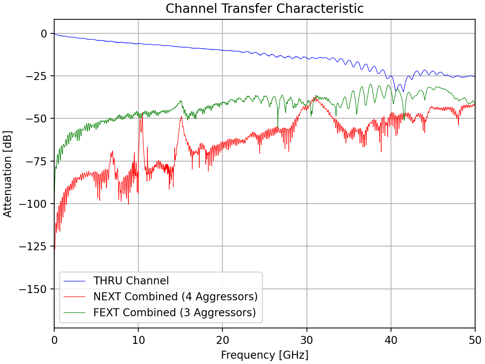
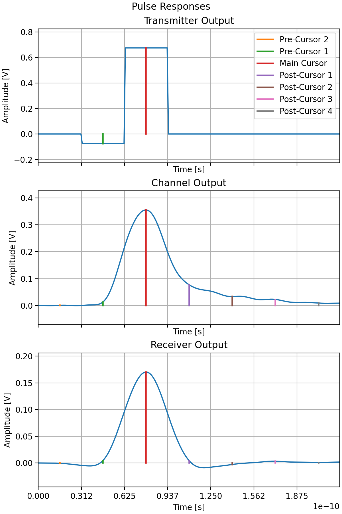

# StatEye Simulation

Statistical eye modelling tool, StatEye, ported to Python 3. Uses statistical methods to model various wireline effects to estimate the performance of different wireline link configurations, provides estimates for Bit Error Rates, Eye dimensions, as well as various plots relating to link performance. 

By default, an equalized PAM-4 link has been created. This link is ready to simulate out of the box. Enjoy!

## Features 

- Reading in Touchstone (`.s4p`) files for channel data
- Simulating and characterizing the performance of different modulation schemes such as PAM-4, with different signalling (including 1+D and 1+0.5D)
- Introducing the impairment effects of cross-talk, jitter, noise, and distortion
- Plotting channel and equalizer behaviour curves
- Optimizing equalizers for a given system configuration using a genetic algorithm

# Operation

Operation of the StatEye tool is meant to be simple. The majority of user effort is in configuring the simulation to suit one's needs. The general flow for setting up and running a simulation is as follows.

1. Upload desired Touchstone (`.s4p`) files and/or `.mat` files to describe distortion or pulses. *Note: Touchstone files for channels need to go into the `/touchstone/` folder.*
2. Configure simulation settings to match desired parameters. Check the example files for baseline configurations.
   - Refer to desired files for channels
   - Set desired output plots
   - Adjust the amount of taps in equalizers
   - Select the parameters to be adjusted in the adaption process, if enabled
3. Adjust the `stateye.py` script to read the simulation configuration function from the desired simulation file.
4. Run the `stateye.py` script.
   - Users may be asked whether or not to update the previously saved channel information. **This is needed if the Touchstone files are updated**, but can be skipped in most cases.
   - If the simulation is expected to take a long time, the user will need to confirm that they want the simulation to proceed.
5. Wait for the simulation to complete.
6. Enjoy the results!

*Tip: To increase the speed of the simulation, reduce the number of impulse response pre and postcursors. This will reduce the accuracy of the final results.*

## Example Outputs

The following output plots are generated using the configuration in `generateUserSettingsExample0.py`.

Polots related to the system's characteristics

The pulse response of the system, there are some slight deviations from the MATLAB version due to the different approaches taken to model it. In MATLAB a polynomial was fit to the frequency resonse, however in Python the discrete time response based on frequency response was used with no curve fitting.

Using the pulse response with the different possible data strings to record the different possible inter-symbol interference trajectories for the system, to take.

Plots of the various influences on the system.

The final probability density distribution and analysis.

# Knob Definitions

There are many knobs that can have an effect on the simulation, here is a complete list with explanations:

## General Settings

| Setting Knob | Explanation |
| --- | --- |
|`General.SymbolRate`                 |  the system sampling rate [samples/second] |
|`General.SignalingMode`              |  the modulation scheme ('standard': conventional baseband, '1+D' and '1+0.5D': partial signalling, 'clock': a clock signal) |
|`General.CodingGain`                 |  apply coding gain (possible when using MLSD decoding with partial signalling schemes) |
|`General.Modulation`                 |  number of modulation levels (2: NRZ, 4: PAM4) |
|`General.SamplesPerSymb`             |  time-domain resolution of the eye diagram |
|`General.xAxisLength`                |  voltage-domain resolution of the eye diagram |
|`General.NumbSymb`                   |  number of periods to display in the eye diagram |
|`General.ContLevels`                 |  number of BER contour levels in the eye diagram |
|`General.TargetBER`                  |  bit-error-rate level to perform eye measurements |
|`General.Plotting.ChannelResponse`   |  display channel response |
|`General.Plotting.CTLEResponse`      |  display CTLE response |
|`General.Plotting.PulseResponse`     |  display pulse response |
|`General.Plotting.JitterSource`      |  display jitter distribution |
|`General.Plotting.NoiseSource`       |  display noise distribution |
|`General.Plotting.DistortionSource`  |  display linear distortion |
|`General.Plotting.ISI`               |  display trace eye diagram (CAREFUL: THIS CAN TAKE A LONG TIME TO DISPLAY) |
|`General.Plotting.PDFInitial`        |  display initial eye diagram |
|`General.Plotting.PDFCrossTalk`      |  display eye diagram after adding cross-talk |
|`General.Plotting.PDFDistorted`      |  display eye diagram after adding linear distortion |
|`General.Plotting.PDFJitter`         |  display eye diagram after adding jitter |
|`General.Plotting.PDFNoise`          |  display eye diagram after adding noise |
|`General.Plotting.PDFFinal`          |  display final eye diagram |
|`General.Plotting.BER`               |  display BER contour levels superimposed over BER plot |
|`General.Plotting.BER2`              |  display BER contour levels superimposed over eye diagram |
|`General.Plotting.Results`           |  display eye measurement results |

## Adaption

| Setting Knob | Explanation |
| --- | --- |
|`Adaption.Adapt`                     |  run adaption algorithm |
|`Adaption.TotalParents`              |  number best candidates to keep from previous generation |
|`Adaption.ChildrenPerParent`         |  number of new candidates to generate per parent |
|`Adaption.TotalMutations`            |  number of randomly generated candidates |
|`Adaption.Mode1Generations`          |  number of generations to run while applying coarse adjustment |
|`Adaption.Mode2Generations`          |  number of generations to run while applying fine adjustment |
|`Adaption.Knobs`                     |  specify which knobs to optimize (must provide full path i.e.: transmitter.EQ.taps.pre1) |

## Transmitter Settings

| Setting Knob | Explanation |
| --- | --- |
|`Transmitter.SignalAmplitude`        |  transmitter supply voltage [V] |
|`Transmitter.IncludeSourceImpedance` |  include 50ohm source impedance (halves transmit signal voltage) |
|`Transmitter.TRise`                  |  signal rise time |
|`Transmitter.TXBandwidth`            |  transmitter analog bandwidth [Hz] |
|`Transmitter.PreCursorCount`         |  number of pre-cursors to consider in eye diagram |
|`Transmitter.PostCursorCount`        |  number of post-cursors to consider in eye diagram |
|`Transmitter.EQ.AddEqualization`     |  apply FIR equalization |
|`Transmitter.EQ.Taps`                |  specify FIR equalization tap values |
|`Transmitter.Jitter.AddJitter`       |  apply transmitter jitter |
|`Transmitter.Jitter.STDDeviation`    |  specify random jitter standard deviation [UI] |
|`Transmitter.Jitter.Amplitude`       |  specify deterministic jitter amplitude [UI] |
|`Transmitter.Jitter.DCD`             |  specify duty-cycle distortion jitter [UI] |
|`Transmitter.Noise.AddNoise`         |  apply transmitter noise |
|`Transmitter.Noise.StdDeviation`     |  specify random noise standard deviation [V] |
|`Transmitter.Noise.Amplitude`        |  specify deterministic noise amplitude [V] |
|`Transmitter.Noise.Frequency`        |  specify deterministic noise frequency [Hz] |
|`Transmitter.Distortion.AddDistortion` | add transmitter linear distortion |
|`Transmitter.Distortion.FileName`    |  file specifying 1-to-1 voltage mapping (structure containing "input" and "output" vectors of same length) |

## Channel Settings

| Setting Knob | Explanation |
| --- | --- |
|`Channel.AddChannel`                 |  apply channel to link |
|`Channel.AddCrossTalk`               |  apply crosstalk |
|`Channel.AddNotch`                   |  apply a notch to channel transfer function |
|`Channel.NotchFreq`                  |  specify notch frequency [Hz] |
|`Channel.NotchAttenuation`           |  specify notch attenuation [dB] |
|`Channel.ModelCircuitTF`             |  convolve link response with an additional pulse response to model a circuit who's response is known |
|`Channel.ModelCircuitTFName`         |  specify additional pulse response file |
|`Channel.OverrideResponse`           |  override transmitter and channel response with a custom pulse response (can still apply receiver equalization) |
|`Channel.OverrideFileName`           |  specify custom pulse response file |
|`Channel.Approximate`                |  approximate cross-talk as a noise source to speed up simulation |
|`Channel.MakeAsynchronous`           |  assume aggressor channels are not synchronized with victim channel and thus impairment is applyed to all sampling phases equally ||
|`Channel.FileNames`                  |  specify channel files (includes THRU, NEXT and FEXT channels) |
|`Channel.Noise.AddNoise`             |  apply thermal noise |
|`Channel.Noise.NoiseDensity`         |  specify thermal noise density [V^2/Hz] |

## Reciever Settings

| Setting Knob | Explanation |
| --- | --- |
|`Receiver.SignalAmplitude`           |  specify receiver supply voltage [V] |
|`Receiver.PreAmp.AddGain`            |  apply pre-amplification |
|`Receiver.PreAmp.Gain`               |  specify pre-amplification gain |
|`Receiver.CTLE.AddEqualization`      |  apply continuous-time linear equalization |
|`Receiver.CTLE.ZeroFreq`             |  specify CTLE transfer function zero frequency [Hz] |
|`Receiver.CTLE.ZeroNumb`             |  specify number of zeros to apply to CTLE transfer function  |
|`Receiver.CTLE.Pole1Freq`            |  specify primary CTLE transfer function pole frequency [Hz] |
|`Receiver.CTLE.Pole1Numb`            |  specify number of primary poles to apply to CTLE transfer function |
|`Receiver.CTLE.Pole2Freq`            |  specify secondary CTLE transfer function pole frequency [Hz] |
|`Receiver.CTLE.Pole2Numb`            |  specify number of secondary poles to apply to CTLE transfer function |
|`Receiver.FFE.AddEqualization`       |  apply FFE equalization |
|`Receiver.FFE.Taps`                  |  specify FFE tap values |
|`Receiver.DFE.AddEqualization`       |  apply DFE equalization |
|`Receiver.DFE.Taps`                  |  specify DFE tap values |
|`Receiver.Jitter.AddJitter`          |  apply receiver jitter |
|`Receiver.Jitter.STDDeviation`       |  specify random jitter standard deviation [UI] |
|`Receiver.Jitter.Amplitude`          |  specify deterministic jitter amplitude [UI] |
|`Receiver.Jitter.DCD`                |  specify duty-cycle distortion jitter [UI] |
|`Receiver.Noise.AddNoise`            |  apply receiver noise |
|`Receiver.Noise.StdDeviation`        |  specify random noise standard deviation [V] |
|`Receiver.Noise.Amplitude`           |  specify deterministic noise amplitude [V] |
|`Receiver.Noise.Frequency`           |  specify deterministic noise frequency [Hz] |
|`Receiver.Distortion.AddDistortion`  |  add receiver linear distortion |
|`Receiver.Distortion.FileName`       |  file specifying 1-to-1 voltage mapping (structure containing "input" and "output" vectors of same length) |

# Remaining Work

- [x] Fix up and validate the adaption system
- [x] Perform more varied tests of the system
- [x] Polish up the figure formatting. E.g. prevent axes labels overlapping adjacent plots when the window is sized smaller.
- [x] Port more example configurations for users
- [x] Update and upload documentation for operation based on the "readme"s from MATLAB
- [x] Clean up comments and disclaimers in files
- [ ] Verify accuracy of system simulation (pulse and CTLE responses)
- [ ] Investigate the use of an alternative, more interactive graphics library like [pyqt](https://www.pyqtgraph.org/) or [Altair](https://altair-viz.github.io/index.html)
- [x] Improve installation process. Perhaps preparing this as a package for Anaconda or pip.

# Dependancies

In addition to running Python 3.10 or newer, the following libraries are needed to run this code:

- [NumPy](https://numpy.org/install/)
- [SciPy](https://scipy.org/install/)
- [matplotlib](https://matplotlib.org/stable/users/getting_started/index.html#installation-quick-start)
- [scikit-rf](https://github.com/scikit-rf/scikit-rf)
- [Python Control Library](https://python-control.readthedocs.io/en/0.9.3.post2/intro.html)

These can all be automatically installed/verified to be the right versions using the following command in the project directory:

`pip install -r requirements.txt`

*NOTE: This may run on earlier versions of the packages and Python, but it has only been extensively tested on Python 3.10 with the package versions specified as the minimums in `requirements.txt`.*

# Credit

Originally written in MATLAB by Jeremy Cosson-Martin and Jhoan Salinas for Ali Sheikholeslami's research group. Porting to Python was done by Savo Bajic as a project for Ali Sheikholeslami's wireline course, ECE1392, based on version 1.11 of StatEye in MATLAB.

The Touchstone files used for examples were provided by Samtec as part of the IEEE 802.3ck 100 Gb/s per Lane Electrical Study Group. More information is available in the [Touchstone folder readme](/touchstone/readme.md).